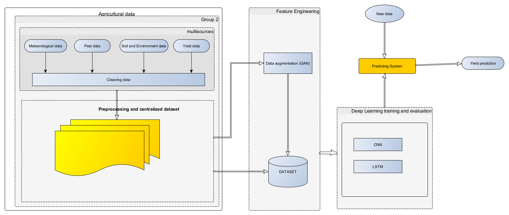

# DEEP LEARNING(AIOT) and IOT TO IMPROVE CROP MONITORING

This repository contains the following files:

- `README.md`: This file provides an overview of the project.
- `assets/`: This directory contains various project assets.
- `data/`: This directory contains saved model of project.
- `index.html`: The main HTML file for the website.
- `login.html`: The HTML file for the login page.
- `noteboostatk/`: This directory contains project notebooks.
- `requirements.txt`: The file listing the project dependencies.

Other Files:>

- `ai/`: This directory contains AI-related files.
- `data/`: This directory contains data files used in the project.
- `index copy.html`: A copy of the main HTML file.
- `input/`: This directory contains input files for the project.
- `new-pw.html`: The HTML file for the password reset page.
- `register.html`: The HTML file for the registration page.
- `website/`: This directory contains website-related files.

## Problem statement

This projct is Based on PHd research in deep learning model with Iot to improve crop monitoring. Many research papers in Artificial Intelligence applied to agriculture have mentionned the way that, it is difficult to have result that approach reality because of choice of data and the source of data. to have a good yield production research must make emphasis in most parameters that impact productin many as possible. This project take basic parameters as remote sensing images, climate data, soil data, pass crop production. Other parameters will be real-time environment and soil data come from IoT sensor. The researh is made for agro-industrie but make emphasis on small farmer. So agriculture practice is on parameters that is also necessary.
The system will be essential toot for decision-makers.It provide advices about agricultural pratices, recommend the most suitable crop cultivation and details about fertilizers. 

To be robust, system is based on deep learning model which combine CNN, LSTM and GAN for trainning and prediction. The architecture of system use choegraphy of microservices to dlivers result. system has many source of data, some data will come from Iot sensors.
Our yield prediction model will focus on 6 crops : maize, cocoa, coffee,cotton, cassava banana.

## Dataset

Dataset Link - <https://www.kaggle.com/code/

The dataset contains 2200 rows and 8 cloumns. The values of columns 1 to 7 ['N', 'P', 'K',  'Temperature', 'Humidity', 'pH', 'Rainfall'] determine the outcome - the suitable crop. The dataset contains 22 crops ['rice', 'maize', 'chickpea', 'kidneybeans', 'pigeonpeas', 'mothbeans', 'mungbean', 'blackgram', 'lentil', 'pomegranate', 'banana', 'mango', 'grapes', 'watermelon', 'muskmelon', 'apple', 'orange', 'papaya', 'coconut', 'cotton', 'jute', 'coffee'] that are recommended based on the other column values.

- N - ratio of Nitrogen content in soil
- P - ratio of Phosphorous content in soil
- K - ratio of Potassium content in soil
- Temperature - temperature in degree Celsius
- Humidity - relative humidity in %
- ph - ph value of the soil
- Rainfall - rainfall in 

## Target variable: Crop

## Model

CNN(Convolutionnal Neural Network) a supervised deep learning algorithm that is  use for recognition, classification. LSTM (Long-Short Term Memory) a supervised deep learning algorithm use for time series. GAN(Generative Adverserial Network) is an unsupervised deep learning algorithm for data generation.

##  Model architecture

## To run the project

1. Clone the repository: `git clone https://github.com/Pavtino/AgriBot.git`
2. Open the project in any IDE
3. Create a virtual environment: `python -m venv venv`
4. Activate the virtual environment: `venv\Scripts\activate` or `source venv/bin/activate`
5. Install the dependencies: `pip install -r requirements.txt`
6. Run the project: `python app/v1/app.py`
7. Open the browser and go to the URL: `http://localhost:5000`
